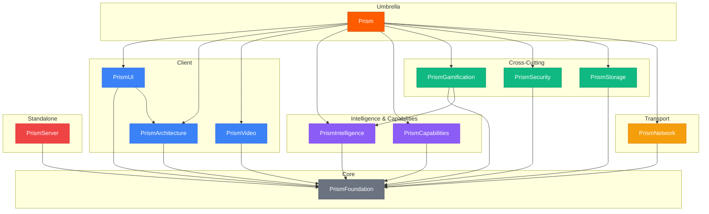
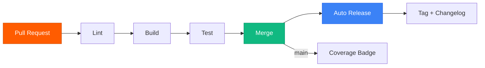

<div align="center">

# Prism

**The modular Swift SDK for Apple platforms and servers.**

[Documentation](https://docs.prism.byescaleira.com) · [Get Started](https://docs.prism.byescaleira.com/quickstart) · [Landing Page](https://prism.byescaleira.com)


</div>

---

<table>
<tr>
<td align="center" width="33%">
<b>13 Modules</b><br>
<sub>From Foundation to Server — pick what you need</sub>
</td>
<td align="center" width="33%">
<b>Zero Dependencies</b><br>
<sub>Pure Apple frameworks. No third-party runtime deps</sub>
</td>
<td align="center" width="33%">
<b>199+ Components</b><br>
<sub>Token-driven design system with 3 themes</sub>
</td>
</tr>
<tr>
<td align="center">
<b>Full Server Stack</b><br>
<sub>HTTP, WebSocket, SSE, GraphQL, MCP, Database</sub>
</td>
<td align="center">
<b>AI/ML Built In</b><br>
<sub>Core ML, Apple Intelligence, RAG, NLP</sub>
</td>
<td align="center">
<b>3000+ Tests</b><br>
<sub>Strict concurrency. Swift Testing framework</sub>
</td>
</tr>
</table>

---

## Architecture



Every module depends only on PrismFoundation. Import only what you need, or use the `Prism` umbrella for everything.

> [!TIP]
> PrismServer is a standalone server framework — it is **not** included in the Prism umbrella so client apps stay lightweight.

---

## Modules

| Module | Focus | Docs |
|--------|-------|------|
| **PrismFoundation** | Entities, logging, analytics, locale, date formatting | [Reference](https://docs.prism.byescaleira.com/foundation/protocols) |
| **PrismNetwork** | HTTP client, WebSocket, GraphQL, cache, retry, offline queue | [Reference](https://docs.prism.byescaleira.com/network/client) |
| **PrismArchitecture** | Store, reducer, middleware, router, effects (UDF) | [Reference](https://docs.prism.byescaleira.com/architecture/store) |
| **PrismUI** | 199+ components, 3 themes, 6 design tokens, accessibility | [Reference](https://docs.prism.byescaleira.com/ui/theme) |
| **PrismVideo** | Video download, composition, progress streaming | [Reference](https://docs.prism.byescaleira.com/video/overview) |
| **PrismIntelligence** | Core ML, Apple Intelligence, language models, RAG | [Reference](https://docs.prism.byescaleira.com/intelligence/overview) |
| **PrismCapabilities** | Camera, Bluetooth, HealthKit, StoreKit, NFC, 20+ APIs | [Reference](https://docs.prism.byescaleira.com/capabilities/auth) |
| **PrismServer** | HTTP server, WebSocket, SSE, GraphQL, MCP, database, jobs | [Reference](https://docs.prism.byescaleira.com/server/core/server) |
| **PrismGamification** | Challenges, streaks, badges, leaderboards, AI messages | [Reference](https://docs.prism.byescaleira.com/gamification/overview) |
| **PrismSecurity** | Encryption, biometrics, keychain, cert pinning, JWT, audit | [Reference](https://docs.prism.byescaleira.com/security/overview) |
| **PrismStorage** | Disk, Memory, Keychain, SwiftData, encrypted, compressed | [Reference](https://docs.prism.byescaleira.com/storage/overview) |
| **PrismPreview** | Interactive component catalog | — |
| **Prism** | Umbrella — `import Prism` gives you everything | [Install](https://docs.prism.byescaleira.com/installation) |

<details>
<summary><b>Client Modules</b> — Foundation, Network, Architecture, UI, Video</summary>

<br>

**PrismArchitecture** provides a unidirectional data flow with `PrismStore`, `PrismReducer`, `PrismMiddleware`, and `PrismRouter`. State is `@Observable`, effects are async, and middleware composes naturally.

```swift
@MainActor @Observable
final class PrismStore<State: Sendable, Action: Sendable> { ... }
```

**PrismNetwork** offers type-safe endpoints with built-in caching, retry, deduplication, and offline queuing:

```swift
enum UserAPI: PrismNetworkEndpoint {
    case profile(id: String)

    var host: String { "api.example.com" }
    var path: String {
        switch self {
        case .profile(let id): "/users/\(id)"
        }
    }
}

let user: User = try await client.request(on: UserAPI.profile(id: "42"))
```

**PrismUI** ships 199+ components across primitives, forms, charts, messaging, navigation, and accessibility — all driven by 6 design tokens and 3 themes.

</details>

<details>
<summary><b>Intelligence & Capabilities</b> — AI/ML and 20+ device APIs</summary>

<br>

**PrismIntelligence** unifies Core ML, Apple Intelligence, and remote language models behind a single API. Supports text classification, tabular regression, and foundation model adapters.

**PrismCapabilities** wraps 20+ platform APIs into a consistent interface: Camera, Bluetooth, HealthKit, StoreKit, NFC, Location, GameCenter, CloudKit, Wallet, App Clips, and more.

</details>

<details>
<summary><b>Engagement & Security</b> — Gamification, Security, Storage</summary>

<br>

**PrismGamification** provides challenges, streaks, badges, leaderboards, and points — with AI-driven recommendations via PrismIntelligence integration.

```swift
enum AppChallenge: String, PrismChallenge, CaseIterable {
    case firstPost
    var title: String { "First Post" }
    var type: PrismChallengeType { .milestone }
    var goal: Int { 1 }
    var points: Int { 50 }
    var challengeDescription: String { "Create your first post" }
}
```

**PrismSecurity** covers encryption (AES-GCM, ChaCha20-Poly1305), biometric auth, keychain management, certificate pinning, JWT handling, audit logging, and integrity checks.

**PrismStorage** abstracts 9 backends (Disk, Memory, Keychain, SwiftData, Encrypted, Compressed, Defaults, Batch, Composite) behind sync and async protocols with migration support.

</details>

<details>
<summary><b>Server</b> — Full-featured backend framework</summary>

<br>

**PrismServer** is an enterprise-grade server framework built entirely in Swift. Features include:

- HTTP/1.1 and HTTP/2 with TLS
- WebSocket rooms, Server-Sent Events
- GraphQL schema, parser, and executor
- MCP (Model Context Protocol) integration
- SQLite database with query builder, migrations, seeder, relationships, soft deletes
- Background job queue with cron scheduling
- Middleware suite: CORS, Auth, Rate Limit, Session, Compression, Security Headers, CSRF
- OpenAPI/Swagger UI generation
- Circuit breaker, health checks, distributed tracing
- Clustering and graceful shutdown

</details>

---

## Quick Start

### Installation

```swift
// Package.swift
dependencies: [
    .package(url: "https://github.com/byescaleira/prism.git", from: "4.4.0")
]
```

### iOS App

```swift
import PrismUI
import PrismArchitecture

struct CounterView: View {
    @State var store = PrismStore(
        initialState: CounterState(count: 0),
        reducer: CounterReducer()
    )

    var body: some View {
        VStack(spacing: .md) {
            Text("\(store.state.count)")
                .font(.headlineLarge)
            PrismButton("Increment") {
                store.send(.increment)
            }
        }
    }
}
```

### Server API

```swift
import PrismServer

let server = PrismServerBuilder()
    .middleware(PrismCORSMiddleware())
    .middleware(PrismLoggingMiddleware())
    .get("/health") { _ in
        PrismHTTPResponse(status: .ok, body: .text("OK"))
    }
    .post("/api/users") { request in
        let body = try request.decodeJSON(CreateUserRequest.self)
        return PrismHTTPResponse(status: .created, body: .json(body))
    }

try await server.build().start(port: 8080)
```

> [!NOTE]
> Requires **Swift 6.3+** and **Xcode 26.4+**. Minimum deployment targets: iOS 26, macOS 26, tvOS 26, watchOS 26, visionOS 26.

---

## Design System

PrismUI is built on a token-driven architecture with 3 themes and 6 token categories:

| Token | Purpose | Examples |
|-------|---------|---------|
| **Color** | Semantic palette | `.brand`, `.surface`, `.error`, `.onBackground` |
| **Typography** | Type scale | `.headlineLarge`, `.bodyMedium`, `.caption` |
| **Spacing** | Consistent whitespace | `.xs`, `.sm`, `.md`, `.lg`, `.xl` |
| **Radius** | Corner radii | `.sm`, `.md`, `.lg`, `.pill` |
| **Elevation** | Shadow/depth levels | `.raised`, `.floating`, `.overlay` |
| **Motion** | Animation curves | `.standard`, `.emphasized`, `.spring` |

```swift
PrismButton("Save") { save() }
    .prismTheme(DarkTheme())
```

> [!TIP]
> Use **PrismPreview** to browse all 199+ components in an interactive catalog.

---

## CI/CD



Every PR runs the full quality gate. Merges to main auto-release with semantic versioning and changelog generation.

---

## Testing

3000+ tests across 250+ suites. Swift Testing framework with strict concurrency.

```bash
make test       # run all tests + coverage
make validate   # full pipeline: lint > build > test
```

> [!IMPORTANT]
> All public API changes require corresponding test coverage. See [CONTRIBUTING.md](CONTRIBUTING.md) for details.

---

<details>
<summary><b>Development</b></summary>

<br>

```
make menu
```

```
  Prism — development toolkit

  Quality
    make format     auto-format sources
    make lint       strict lint check
    make build      build all targets
    make test       run tests + coverage
    make validate   full pipeline (lint > build > test)
    make coverage   generate coverage report
    make clean      remove build artifacts

  GitFlow
    make feature name=xyz       create feature branch
    make release version=1.0.0  create release branch
    make hotfix  version=1.0.1  create hotfix branch
    make finish-release         merge release to main
    make finish-hotfix          merge hotfix to main
```

</details>

---

## Documentation

| Resource | Link |
|----------|------|
| Full Documentation (110+ pages) | [docs.prism.byescaleira.com](https://docs.prism.byescaleira.com) |
| Quick Start Guide | [Quickstart](https://docs.prism.byescaleira.com/quickstart) |
| Server Guide | [Server](https://docs.prism.byescaleira.com/server/core/server) |
| Landing Page | [prism.byescaleira.com](https://prism.byescaleira.com) |

---

## Contributing

Prism is open source and contributions are welcome. Whether fixing a bug, adding a feature, or improving documentation — every PR matters.

See [CONTRIBUTING.md](CONTRIBUTING.md) for the full guide and [SECURITY.md](SECURITY.md) for vulnerability reporting.

> [!NOTE]
> All changes must pass `make validate` before merging.

---

## License

MIT License — see [LICENSE](LICENSE) for details.

Created by [Rafael Escaleira](https://github.com/byescaleira)
